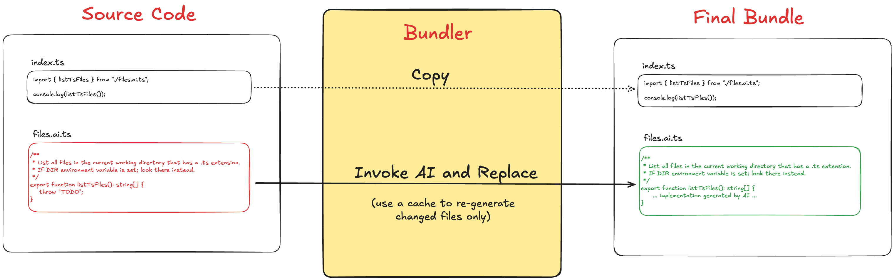

# AI Codegen as a Compile step

## Motivation (Problem statement)

Today, the use of AI coding agents to generate substantial portions of a project is catching on quite rapidly in the industry. 

With that, the following sentiment is also on the rise among us, software engineers: As people who honed the craft during the pre-AI days, the use of coding agents feels like an awkward dance between lucidity (when you are writing code by hand) and insanity (when you are letting the AI take the reins). My personal experience is that this has both cognitive and emotional impact (not pleasant).

Talking about delegating work to something else, let's contrast the use of AI coding agents with using a "third party library". 
Even during pre-AI days, using libraries was quite common. While that is also a form of delegation of work, clearly it doesn't feel the same way as agentic coding. 

I reason this is because: When using a library we are working with a **well understood abstraction**; where as, when using a coding agent, we are working with **no abstraction what so ever** since AI's and human's parts of the work are totally mixed up without any clear boundaries.

I contend that **we need both separation and abstraction when it comes to agentic coding**.

I am proposing here a way of arranging the codebase in such a way that AI generated parts are kept clearly isolated from the rest of the project.

## Solution sketch

With the high level pain point identified, here are the requirements that I have tried to meet with the solution:

1. Separation: Make it possible to clearly separate AI generated code from the rest of the project at least at the file level. This means,
   * AI code is not edited by human
   * Human code is not edited by AI
2. Interopability: Provide as much flexibility as possible when it comes to human written code invoking AI generated code and vice versa.
3. Preserve the inputs to the AI agent: Preserve the specification that produced the AI generated code as a first class artifact in the codebase.
4. Efficiency: Allow incremental changes to the AI generated part of the codebase - that is, use of AI tokens should be efficient and involve only (re)generation of the parts that really need to change.

## This Demo

A system that uses [Bun's](https://bun.com/) [Bundler api](https://bun.com/docs/bundler) to implement the system illustrated by the diagram below:



Key idea: During the "compile" step (bundling), the system looks for files of the pattern `*.ai.*` and submits those files to AI for "completion" before adding them to the bundle. 

For each `*.ai.*` file the prompt used is along the lines of:

```
you should provide the complete implementation of <path/to/file>
```

### Pre-requisites

You need [Bun](https://bun.com/).

```
curl -fsSL https://bun.com/install | bash
```

You need the [pi.dev](https://pi.dev/), the open source coding agent, available as `pi` in the shell.

Easiest way to setup pi, is to first have Nodejs installed and then globally install pi using `npm`:

```
npm install -g --ignore-scripts @earendil-works/pi-coding-agent
```

Next, you need to ensure `pi` is properly connected to an AI provider.

For example you could setup a valid `OPENAI_API_KEY` variable in the environment.

Finally, test that pi works:

```
pi -p "say hello"
```

This should run without error.

### Usage

After the pre-requisites are setup, install the project's library dependencies:

```bash
bun install
```

Next is the "compile" step that performs the AI code generation:

```bash
bun compile
```

This command will trigger a bundling that involes the `pi` agent and will put the final built output in `./build`

Finally, to execute the generated bundle:

```bash
bun start
```

Optionally, at any time during the development process you may also do a typecheck by the TypeScript compiler using:

```
bun typecheck
```

Note: this typecheck's the original sources (i.e. the `*.ai.*` files, before AI completes the missing parts). 
It is expected that these files are already complete enough from a type perspective to be included in the typecheck.

## Closing notes

This system is clearly more constrained than full-on agentic coding. However, I believe those constraints are not limitations, 
but instead serve as guardrails that ensure human judgement is duly utilised throughout the development process.
